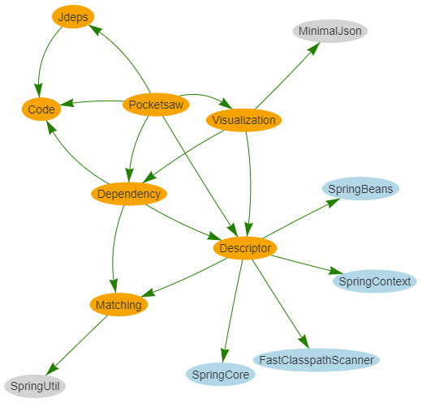
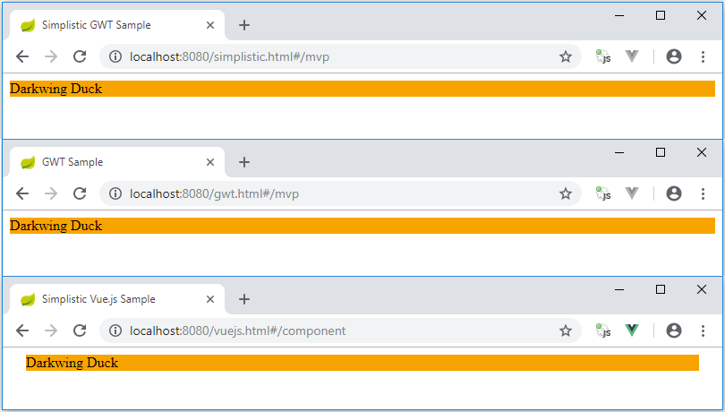

# simplistic-transpiler

Simplistic no-deps Java to JavaScript transpiler proof-of-concept written from scratch using JDK's `JavacTool` with basic @JsInterop compatibility.
Internal JDK APIs (that are needed e.g. for symbol resolution) like `com.sun.tools.javac.tree.*` are hidden behind a facade in order to minimize impact of future internal JDK changes.

The main assumption for the transpiler is that today's JavaScript is much more similar to Java than it used to be (first version of GWT was released 11 years ago!).

## Motivation

I recently discovered [JSweet](http://www.jsweet.org/) and to me it looked like a lightweight GWT alternative.
In contrast to GWT it also has the perfect escape strategy: If you don't like JSweet anymore, drop it and continue with the Typescript code.
If you also don't like Typescript any longer, drop it as well and continue with the JavaScript code.
With a huge GWT code base this is impossible and you're facing a massive vendor lock-in.

The codebase of JSweet is definitively much more hackable than the one of GWT.
Main reason is that it is a transpiler only and does not try to mimic the runtime semantics of Java in JavaScript.
This makes it pretty similar to [ST-JS : Strongly Typed JavaScript](https://st-js.github.io/).

But there is no `@JsInterop` support and the indirection via Typescript seems a bit of overkill to me (the candies concepts tough is pretty cool).
Furthermore, I was not 100% happy with the code structure of JSweet.
For example, the very central class `Java2TypeScriptTranslator` has about 5.700 lines of code.

## Features

Out of curiosity I asked myself: How to write a transpiler?
The result is simplistic-transpiler.
A crazy proof-of-concept written from scratch.
The main features are:
- usage of modern es6 JavaScript (es6 modules, es6 classes, let for variable declarations, 
for of loop, arrow functions...)
- very basic GWT compatibility on `@JsInterop` level
- on-the-fly code generation mode like GWT's Super Dev Mode
  - works as well for helper libraries in separate Maven projects
- Spring MVC REST service integration
- easy JavaScript unit testing
  - Jasmine unit tests executed by Selenium with debug mode support and on-the-fly code generation as well

## Limitations

It is just a proof-of-concept with many missing parts.

For example, the following things are incomplete or missing:
- currently works only in Chrome (for older browsers e.g. Babel could be used to transpile to es5)
- thin adapter layer to align JavaScript and Java (could be for example a modern es6 version of [stjs.js](https://github.com/st-js/st-js/blob/master/client-runtime/src/main/resources/META-INF/resources/webjars/stjs-client-runtime/stjs.js))
- Sourcemap support
- all kinds of loops and a few other Java language constructs
- Java comment preservation in JavaScript source
- tested with Java 8 only for now, Java 9 with Jigsaw is a completely different story...

## Installation

First [pocketsaw](https://github.com/janScheible/pocketsaw) has to be cloned and installed in the local Maven repository with `mvn clean install`.

For running the sample application the following is enough:
```
mvn clean install spring-boot:run
```

## Sub-module structure



## Transpilation example

```java
package com.scheible.sample;

import com.scheible.framework.BaseClass;

public class Example extends BaseClass {

	private static final String CONST = ":-)";
	
	private int value = 42;

	@Override
	public void onModuleLoad() {
		int myInt = 7;

		getDocument().addEventListener("hashchange", (Event event) -> {
			match(event.toString());
		});
	}

	private View match(String url) {
		// ...
	}
}
```

```js
import BaseClass from '../framework/BaseClass.js';

export default class Example extends BaseClass {

	constructor() {
		this.value = 42;
	}

	onModuleLoad() {
		let myInt = 7;

		window.document.addEventListener('hashchange', (event) => {
			this.match(event.toString());
		});
	}

	match(url) {
		// ...
	}
}
Example.CONST = ':-)';
```

`BaseClass.js` is available via `http://localhost:8080/transpiler/com/scheible/sample/Example.js` which corresponds to the Java package `com.scheible.sample`.

The biggest missing piece of the puzzle for now are [Class field declarations for JavaScript](https://github.com/tc39/proposal-class-fields) and the follow-up [Static class features](https://github.com/tc39/proposal-static-class-features/).
Both are emulated for now.
Instance variable initialization is moved to the constructor and initial values for static variables are directly assigned to the class.
As soon as both proposals are implemented in the browsers the Java code and the generated JavaScript will really look almost identical.

## Samples

### Web application

The GWT example (simplified version of [reduced-gwt](https://github.com/janScheible/reduced-gwt)) runs as well transpiled by GWT as by the simplistic-transpiler.

The Vue.js example uses Vue.js and Vue Router with the same REST services as the GWT example.
The application is similar to the one in [stjs-vuejs](janScheible/stjs-vuejs).



### Unit testing

The unit tests are using Jasmin in combination with a custom `Runner` and a `TestRule`.
The `JasmineSpecMapperRule` maps the Jasmine results to jUnit results.
Whereas the `JasmineSpringTestRunner` is used by `AbstractJasmineTest` which is a Spring Boot integration test for now.

```java
public class JasmineBasicsTest extends AbstractJasmineTest {

	@Test
	public void testNumberJasmineMatcher() {
		it(() -> {
			expect(42).toBe(42);
		});
	}
}
```

As soon as an attached Java debugger is detected the browser driven by Selenium is not closed and the devtools are shown.
In this mode, the Java test code can be changed on-the-fly and the Jasmine tests are executed after every reload of the page.
This allows a nice workflow for writing unit tests.
